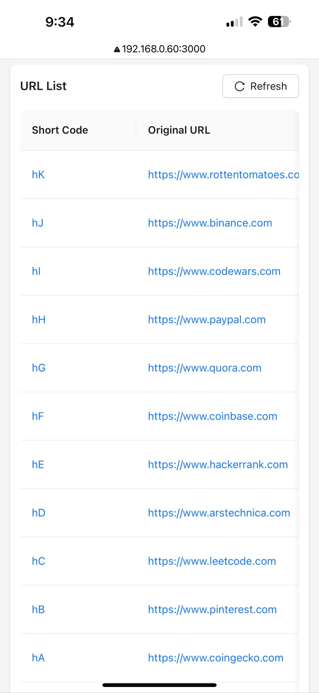
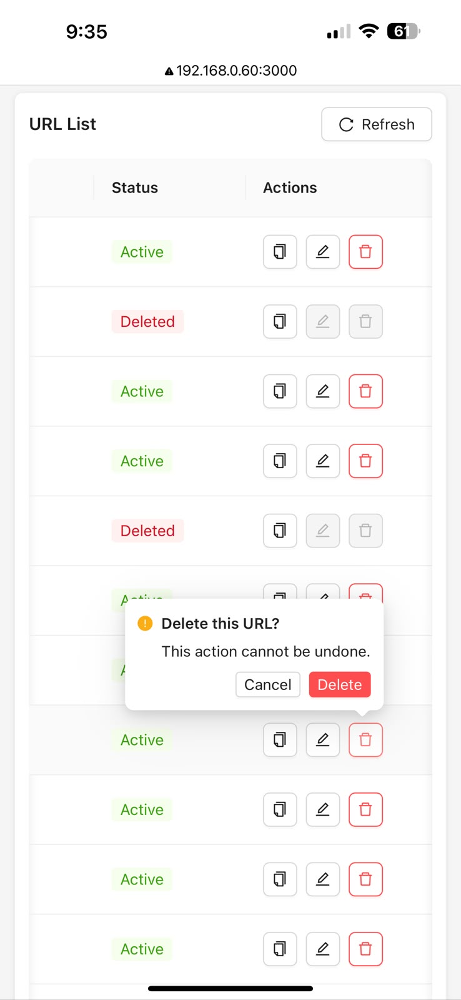
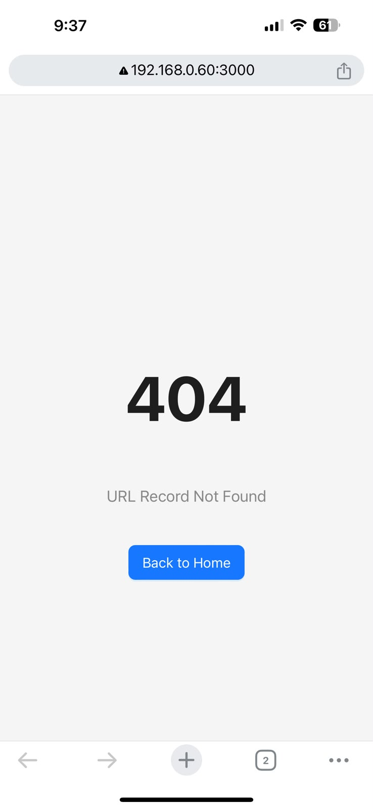

# URL Shortener Service

A full-stack URL shortening service built with a modern monorepo architecture.

- Frontend: React + Vite + Ant Design
- Backend: NestJS + TypeORM + MySQL
- Monorepo: pnpm workspace
- Tooling: Biome (lint/format), Jest
- Deployment: Docker

# Demo


# Screenshots

## PC


## Mobile









# Key features
- Generate short URL from original URL
- Redirect short URL → original URL
- Click tracking (click_count)
- List and manage URLs (allow edit and soft delete the records)

# Architecture Overview

```
FE Client
    ↓
Backend API
    ↓
MySQL DB
```

# Repo Structure

```shell
.
├── apps
│   ├── client/ # Frontend application
│   │   ├── src/
│   │   │   ├── api/ # API to BE
│   │   │   ├── components/ # UI components
│   │   │   ├── pages/ # FE Pages
│   │   │   └── main.ts
│   │   ├── index.html
│   │   └── vite.config.ts
│   │
│   └── server/ # Backend service (NestJS)
│       ├── migration/
│       ├── src/
│       │   ├── app/ # Module of root App
│       │   ├── static/ # Module to hoist static FE assets
│       │   ├── url-manage/ # Module to manage URL Records
│       │   ├── redirect/ # Module to redirect short url
│       │   └── main.ts # Entry file
│       └─ scripts/ # Scripts for DB init
│
├── packages
│   └── shared/ # Shared types / utils
│
├── scripts # scripts for build & deploy
├── docker-compose.yml
├── pnpm-workspace.yaml
├── package.json
└── README.md
```

# Development Environment Setup

- Docker
- Node.js >= 24

# Start with docker compose

```bash
docker compose up
```

Access the application:
```text
http://localhost:3000
```

Swagger Documentation:
```text
http://localhost:3000/swagger/doc
```
# Development Setup

Add `.env` file under apps/server (can copy the `.env.example` file and update to your local env)


```bash
# install dependencies
pnpm install

# FE local Dev
pnpm run dev:client

# BE local dev
pnpm run dev:server
```

# Testing

```bash
# Testing
pnpm run test
```
